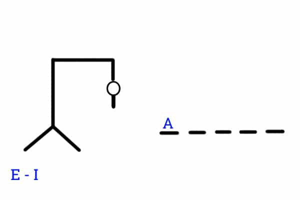

# PROYECTO 21-22
## Introducción
Aquí se encuentra el proyecto de la asignatura de Redes y videojuegos en red (RVR), realizado por Agustín Moure.
## Propuesta
El proyecto final de redes se basará en una adaptación del famoso juego del ahorcado.

Se tratará de una versión colaborativa en la que  todos (menos quien elige la palabra) juegan para ganar, se juega por turnos en orden de entrada en la sala saltandosé siempre al que ha elegido la palabra.

Lo ideal sería realizarlo con un protocolo TCP, sin embargo se va a realizar con protocolo UDP.

