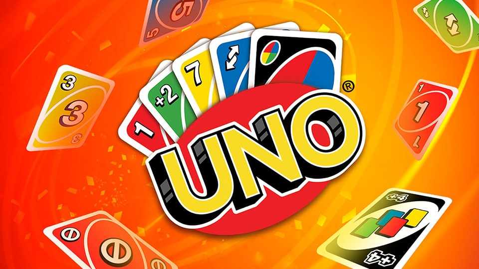

# PROYECTO 21-22
## Introducción
Aquí se encuentra el proyecto de la asignatura de Redes y videojuegos en red (RVR), realizado por Agustín Moure.
## Propuesta
El proyecto final de RVR consiste en replicar el famoso juego del UNO, un juego de cartas en el cual gana el primer jugador en quedarse sin cartas.

Para ello se usará la consola, para ello se usará el protocolo TCP ya que al ser un juego de cartas debemos asegurarnos de que la información se envía correctamente.

 
